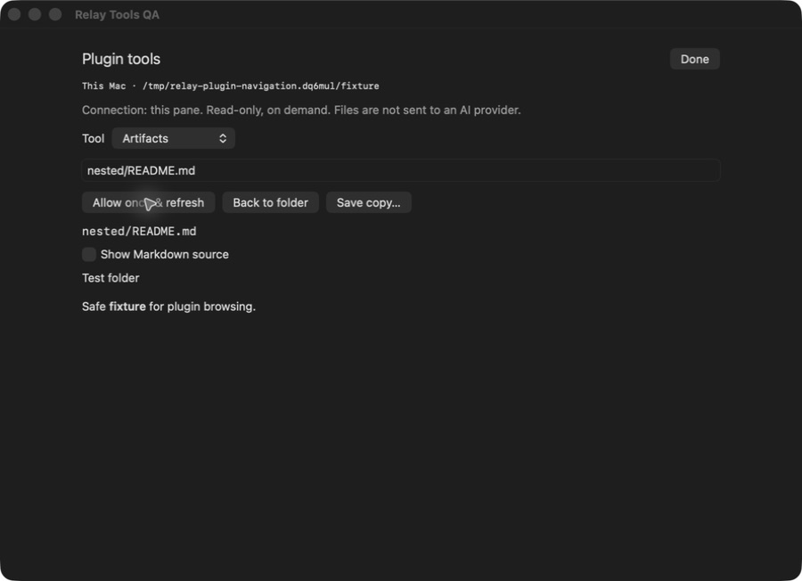

# Relay Artifacts

Browse project results and inspect files without leaving Relay.

*Actual native Relay component captured September 19, 2026 in an isolated test window. Synthetic data only. Development preview—not a promise that these features are in the released app.*

## Status

This repository has an experimental API-2 manifest but **no tagged installable release yet**. Do not use `main` as a release tag.

Features and screenshots here describe the current Relay development implementation. A compatible app and matching helper are required; installed-app and release acceptance remain incomplete.

This is a **data-only package**. Its manifest selects operations implemented in [Relay](https://github.com/genomewalker/relay-terminal). It does not download executable plugin code, run install hooks or add background polling.

## Features

- On-demand folder browsing, folder-up navigation and local filtering.
- Downsampled image previews, plain text, CSV/TSV tables and native Markdown formatting.
- Markdown source toggle; HTML remains inert text.
- SHA-256-verified Save copy through the native macOS dialog.

## Install

Wait for a tagged release before installing this package.

1. Use a compatible Relay app and matching `relayd` on the target host.
2. Open **Settings → Plugins**, enter `genomewalker/relay-plugin-artifacts` and the exact released tag.
3. Review the repository, digest and permissions. Install, then explicitly Enable.
4. Select the intended terminal pane and click the puzzle-piece toolbar button.

Updates require another review and start disabled. Disable, Roll back and Uninstall are available in Settings. Safe mode suppresses plugin tools. Existing release assets must not be overwritten.

## Use

Refresh, then click a folder or file to authorize one read. Use Up one folder or Back to folder to navigate. Switch Markdown to source when needed.

The panel captures its originating pane and connection; changing tabs does not retarget a request. File tools need a known working directory. Reopen the panel from the intended directory when necessary. Each read is explicit; active terminal workers and agents are not restarted.

## Permissions and safety

`projectRead`: bounded reads inside the captured project directory. Content is not sent to an AI provider.

Relay checks the enabled package and digest before running and before showing results. An incompatible helper produces an error, not a misleading empty result.

## Limits and remaining work

Regular files up to 8 MiB. Text previews: 128 KiB; tables: 100 rows and 32 columns; image dimension: at most 1600 pixels. Listings inspect at most 500 entries and may be partial. Listed symlinks are omitted. No recursive indexing, HTML execution or remote image loading.

## Verification

Nested folders, Markdown/source switching and outside-directory rejection were checked manually. A paragraph-layout defect found in manual testing was fixed and retested.

The latest combined development run reported 216 Swift tests (one optional network test skipped); the Go race suite passed. These checks do not substitute for installed-app, remote-error, accessibility or release acceptance of the exact versions you deploy.

## Development and issues

Validate the manifest with `python3 -m json.tool relay-plugin.json`. Native implementation and tests live in [Relay](https://github.com/genomewalker/relay-terminal), not this repository. Report runtime problems there with app/helper versions, reproduction steps and redacted diagnostics. Manifest and documentation issues belong here.

No license has been selected for this package yet. Public visibility alone does not grant a reuse license.
